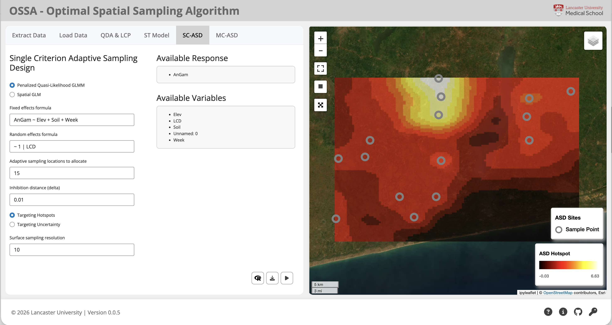

# OSSA - Optimal Spatial Sampling Algorithm

[](https://github.com/dwmorley/lancs-leeg-ossa/actions/workflows/release.yml)
[](https://github.com/dwmorley/lancs-leeg-ossa/pkgs/container/lancs-leeg-ossa)

## About

OSSA is a set of algorithms developed for spatial sampling designs in absence of any prior information about the process, such as species distribution or a disease prevalence (lattice with close pairs) and for adaptive sampling designs (when prior information is available). It also contains an algorithm for ecological area delineation.

This is a User Friendly Shiny App for the Optimal Spatial Sampling Algorithm (OSSA). The app allows users to easily implement OSSA for spatial sampling designs and ecological area delineation without needing interact directly with R code.



## Credits
- The sampling algorithms were developed by Luigi Sedda (University of Lancaster).
- The Shiny app was developed by David Morley (University of Lancaster).

## Installation & Running

OSSA runs locally on your machine using Docker. To get started, follow these steps:
1. Download and install [Docker Desktop](https://www.docker.com/products/docker-desktop/). You will only need to do this once.
2. Pull the latest OSSA image from GitHub Container Registry (ghcr), using your command line or terminal:
```commandline
docker pull ghcr.io/dwmorley/lancs-leeg-ossa:latest
```
3. A new 'image' will be available in Docker Desktop (with the name like the ghcr URL above).
4. Run the image to create a 'container' (a running instance of the software).
5. Once the container is running, navigate the local host (e.g. http://127.0.0.1:8000/) in your web browser.
If you are having trouble getting this URL to connect, see the instructions after the last step here.
6. OSSA is ready to use!
7. To stop the container, simply click the "Stop" button in Docker Desktop. You can restart the container at any time to use OSSA again.

If you are having trouble getting your localhost to work, a solution can be to go to the 'Optional settings' after clicking 'Run' on an
image in Docker Desktop - in the 'Ports' section enter a '0' to assign a random port, then click 'Run'. On launching, there should be a
clickable link to your local host like ```dwmorley/lancs-leeg-ossa:latest 55002:8000```.

## Downloading files from the app

Downloads can be found from Docker Desktop:

 - Click on three dots icon > show container actions > View files.
 - Any downloads will be in, ```home > appuser > Downloads```
 - Right-click on the file you want to download and select "Save". The file will be downloaded to your local machine.


## Report an Issue

To report a bug, crash, or unexpected behavior etc, please copy the log messages from Docker
1. Click on three dots icon > show container actions > Use Docker Debug
2. Switch to the "Logs" tab and copy the log messages.
3. Use the "New Issue" button on the GitHub repository to create a new issue, and paste the log messages in the description.

## Development

### VS Code & Poetry
- Ensure Poetry is installed.
- Run `poetry install` to install dependencies.
- Run `poetry run shiny run app.py` to start the app.
- To debug the Shiny app in Visual Studio Code and localhost (e.g. http://127.0.0.1:8000/), you can use the following `launch.json` configuration:
```
{
    "version": "0.2.0",
    "configurations": [

        {
            "name": "Debug Shiny App",
            "type": "debugpy",
            "request": "launch",
            "module": "shiny",
            "args": ["run", "--reload", "app.py"],
            "console": "integratedTerminal",
            "justMyCode": false,
            "cwd": "${workspaceFolder}"
        }
    ]
}
```

- Test data can be found in ```lancs-leeg-ossa/test_data``` folder


- Uses `poetry run flake8` for linting.
- Uses `poetry run black app.py` to format the code.
- Run on all files: `poetry run pre-commit run --all-files`

### Docker
- To debug in Docker ```docker compose up --build```
- Then Ctrl + C to stop the container and run ```docker compose down``` to clean up.

- The above is useful for a quick test if there are only small code changes. To force a total rebuild, including all R and Python environments:
```
docker compose down -v
docker compose build --no-cache
docker compose up
```

### To run locally without Docker
- Clone this repository
- In a terminal/command window, navigate to the project directory (where app.py lives).
- Ensure Poetry is installed and run `poetry install` to install dependencies.
- Run `poetry run shiny run app.py` to start the app.
- Open your web browser and navigate to http://127.0.0.1:8000/

## Deployment

To create a new docker image on GitHub:

```commandline
git tag v0.0.1
git push origin v0.0.1
```

GitHub actions will automatically create the package.

To refresh the image in Docker Desktop, you can pull the latest image:
```commandline
docker pull ghcr.io/dwmorley/lancs-leeg-ossa:latest
